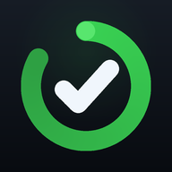

# Sober

A dead-simple sobriety tracker. It shows **how many days you've been sober** and a **GitHub-style activity grid** of your whole year.

<p align="center">
  
</p>

This repo ships the app two ways:

| Version | Where it lives | Best for |
|---------|----------------|----------|
| **Native iOS app** (SwiftUI) | [`ios/`](ios/) | A real iPhone app you build in Xcode and run on your device |
| **Web app** (PWA) | repo root | Try it instantly in any phone browser, installable to the home screen |

Both have the same features and the same dark, GitHub-inspired look.

---

## 📱 Native iOS app (SwiftUI)

A proper iPhone app written in SwiftUI. No third-party dependencies.

### Features
- **Progress ring** around your day count, filling toward the next milestone
- **One-tap daily check-in** with haptic feedback
- **Milestone badges** (1 week → 1 year) that light up as you reach them, with a **confetti celebration**
- **What you've reclaimed** — money not spent and time saved, from a daily figure you set
- **Year activity grid** — the whole year fits on screen (no scrolling), every sober day lit green
- **Stats** — current streak, best streak, total sober days
- **Home-screen & lock-screen widgets** (see below)
- **Private & offline** — data is stored on-device; nothing leaves your phone

### Widgets
The app includes a WidgetKit extension (`SoberWidget`) with:
- **Home screen** — small (days + next milestone) and medium (days, streak, money saved, mini activity grid)
- **Lock screen** — circular gauge, inline, and rectangular complications

Widgets read the same data as the app through an **App Group** (`group.com.sober.app`).

### Build & run
> Requires a Mac with **Xcode 15+**. (iOS apps can only be built on macOS.)

1. Open `ios/Sober/Sober.xcodeproj` in Xcode.
2. Select the **Sober** scheme and a simulator (or your iPhone).
3. **For the widgets to share data**, enable the App Group on **both** targets:
   - Select the **Sober** target → **Signing & Capabilities** → **+ Capability → App Groups** → check (or add) `group.com.sober.app`.
   - Do the same for the **SoberWidgetExtension** target.
   - On a real device you'll also pick your Apple ID **team** and may need to make the bundle IDs unique (keep the app `com.…` and widget `com.….SoberWidget`, and the App Group identical on both).
   - *In the Simulator, App Groups work without a paid developer account.*
4. Press **▶ Run**. Long-press the home screen / lock screen to add the **Sober** widget.

First launch: tap the ⚙ gear, set your **sobriety start date**, and optionally a **daily $ / hours** figure. Every day from that date counts automatically; you can also tap **Check in** each day.

### Project layout
```
ios/Sober/
├── Sober.xcodeproj
├── Sober/                        App target
│   ├── SoberApp.swift            App entry point
│   ├── ContentView.swift         Main screen (ring, check-in, stats, savings, badges)
│   ├── SobrietyStore.swift       Observable store (persists to App Group, reloads widgets)
│   ├── SobrietyCore.swift        Shared model + stat math + milestones (app & widget)
│   ├── ConfettiView.swift        Milestone celebration
│   ├── Theme.swift               GitHub-inspired color palette (shared)
│   ├── Sober.entitlements        App Group entitlement
│   ├── Views/
│   │   ├── ActivityGridView.swift  Scroll-free year grid
│   │   └── SettingsView.swift       Start date, daily figures, reset
│   └── Assets.xcassets           App icon & accent color
└── SoberWidget/                  Widget extension target
    ├── SoberWidgetBundle.swift   @main widget bundle
    ├── SoberWidget.swift         Timeline provider + home/lock-screen views
    ├── Info.plist                WidgetKit extension point
    └── SoberWidget.entitlements  App Group entitlement
```

---

## 🌐 Web app (PWA)

The original Progressive Web App — zero build step, runs in any browser, installs to your home screen.

### Use it on your phone
1. Host the repo-root files on any static host (GitHub Pages, Netlify, Vercel…). A GitHub Pages workflow is already included (`.github/workflows/deploy.yml`) — enable Pages and it auto-deploys.
2. Open the URL on your phone.
3. **iPhone (Safari):** Share → *Add to Home Screen*. **Android (Chrome):** ⋮ → *Install app*.

### Try it locally
```bash
python3 -m http.server 8000
# open http://localhost:8000
```

### Files
`index.html`, `styles.css`, `app.js`, `manifest.json`, `service-worker.js`, `icons/`

---

## Your data
Everything stays on your device — `UserDefaults` on iOS, `localStorage` on the web. There's no account and no cloud sync by design. *Reset all data* in settings wipes it.
